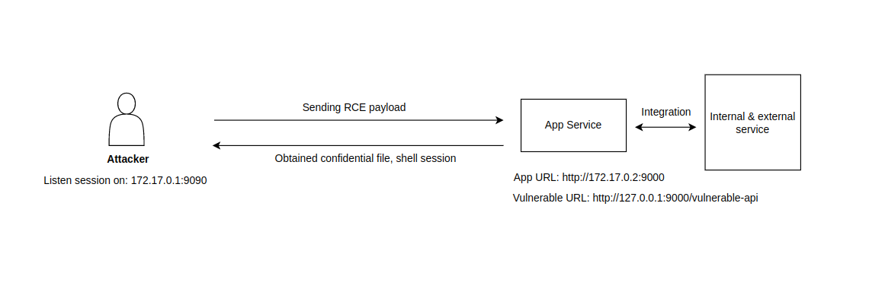

## Vulnerable Node.js App (RCE)
This is just example of Node.js app that contains RCE & just for education purpose only

## Prerequisites
- Docker
- netcat, ncat, nc

## How to do it?
1. Build Docker image & deploy it to server
2. Listen or bind reverse shell on local machine
3. Execute RCE payload to obtain confidential file & shell session

## Information about API service
- `/` - normal & healthy endpoint
- `/vulnerable-api` - vulnerable API endpoint

## Information about RCE script & payload
- `scripts/execute-rce-confidential-file.sh` - obtain confidential file on app
- `scripts/execute-rce-session.sh` - obtain reverse shell session